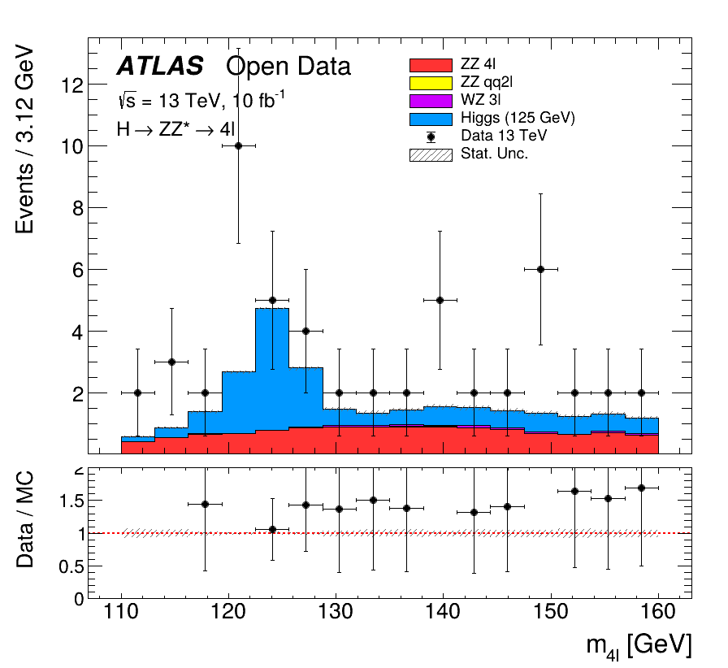

# ATLAS H → ZZ* → 4ℓ Analysis

🌍 **Navigation:** [🇮🇹 Italiano](#-italiano) | [🇬🇧 English](#-english)

<div align="center">
  
  <p><i>The reconstructed Higgs boson invariant mass peak at ~125 GeV, showing Data vs. Monte Carlo prediction.</i></p>
</div>

---

## 🇮🇹 Italiano

### Obiettivo del progetto
Questo repository contiene un'analisi dati in Python (basata su PyROOT) per la ricostruzione del decadimento del Bosone di Higgs nel canale a quattro leptoni ($H \rightarrow ZZ^* \rightarrow 4\ell$). 

L'analisi è stata condotta utilizzando gli **ATLAS Open Data** ufficiali, basati su collisioni protone-protone al CERN a un'energia nel centro di massa di $\sqrt{s} = 13\text{ TeV}$, corrispondenti a una luminosità integrata di $10\text{ fb}^{-1}$. L'obiettivo è mostrare l'intero flusso di lavoro tipico della fisica delle alte energie: dal processamento dei file ROOT grezzi, all'applicazione dei tagli cinematici, fino all'estrazione del segnale dal rumore di fondo.

### Struttura della repository
* 📂 **`data/`**: contiene i file ROOT di input (Dati reali e simulazioni Monte Carlo). *(Nota: non tracciati su Git per limiti di dimensione)*.
* 📂 **`output/`**: directory di runtime per i risultati intermedi e gli istogrammi.
* 📜 **`scripts/analyze4.py`**: script principale. Legge i file ROOT, applica la selezione degli eventi (cutflow) e salva gli istogrammi.
* 📜 **`run_all.py`**: orchestratore batch. Processa automaticamente tutti i file presenti in `data/` generando un file di log dettagliato (`analisi_batch.log`).
* 📜 **`plot_higgs.py` / `plot_higgs2.py`**: macro grafiche finali. Fondono gli output per generare plot in stile ATLAS da pubblicazione, includendo le bande di incertezza statistica e il *Ratio Plot* (Dati/MC).

### Requisiti
* Python 3
* ROOT / PyROOT (CERN) installato e configurato nel `$PYTHONPATH`

### Workflow di Analisi

**1. Selezione degli eventi (Cutflow)**
Lo script `analyze4.py` filtra le collisioni richiedendo:
* Esattamente 4 leptoni ("good" leptons) con tagli su $p_T$ e isolamento.
* Veto su $\Delta R$ e risonanze a bassa massa.
* Identificazione delle coppie $Z_1$ (on-shell) e $Z_2$ (off-shell).
* Tagli cinematici sulle masse invarianti di $Z_1$ e $Z_2$.

**2. Esecuzione Massiva**
```bash
python3 run_all.py

```

*(Processa l'intero dataset producendo file ROOT intermedi separati per ogni sample).*

**3. Generazione del Plot di Scoperta**

```bash
python3 plot_higgs2.py

```

*(Sovrappone i fondi simulati $ZZ, WZ$, il segnale $H \rightarrow 4\ell$ e i Dati reali, salvando il risultato come PDF/PNG).*

---

## 🇬🇧 English

### Project Goal

This repository provides a complete Python (PyROOT-based) analysis framework to reconstruct the Higgs boson decay in the four-lepton "golden channel" ($H \rightarrow ZZ^* \rightarrow 4\ell$).

The analysis is performed using the official **ATLAS Open Data**, which consists of proton-proton collision data collected at the LHC at a center-of-mass energy of $\sqrt{s} = 13\text{ TeV}$, corresponding to an integrated luminosity of $10\text{ fb}^{-1}$. The project aims to demonstrate a full high-energy physics workflow: from processing raw ROOT trees and applying kinematic selections, to the final signal extraction and publication-quality plotting.

### Repository Structure

* 📂 **`data/`**: contains the input ROOT files (Real Data and Monte Carlo simulations). *(Note: untracked due to file size limits)*.
* 📂 **`output/`**: runtime directory for intermediate results and histograms.
* 📜 **`scripts/analyze4.py`**: core analysis script. Reads ROOT trees, applies the event selection (cutflow), and outputs histogram files.
* 📜 **`run_all.py`**: batch orchestrator. Automatically processes all files in the `data/` folder, producing a detailed execution log (`analisi_batch.log`).
* 📜 **`plot_higgs.py` / `plot_higgs2.py**`: final plotting macros. They merge the outputs to generate ATLAS-style plots, including statistical uncertainty bands and Data/MC ratio pads.

### Requirements

* Python 3
* ROOT / PyROOT (CERN) installed and working

### Analysis Workflow

**1. Event Selection (Cutflow)**
The `analyze4.py` script filters collisions based on:

* Exactly 4 "good" leptons satisfying $p_T$ and isolation requirements.
* $\Delta R$ and low-mass resonance vetoes.
* $Z_1$ (on-shell) and $Z_2$ (off-shell) pair identification.
* Kinematic cuts on $Z_1$ and $Z_2$ invariant masses.

**2. Batch Processing**

```bash
python3 run_all.py

```

*(Runs the selection over the entire dataset, saving independent ROOT files for each sample).*

**3. Generating the Discovery Plot**

```bash
python3 plot_higgs2.py

```

*(Stacks the simulated $ZZ, WZ$ backgrounds with the $H \rightarrow 4\ell$ signal and overlays the real Data, exporting the final PDF/PNG).*

---

*Distributed under the terms of the [LICENSE](https://www.google.com/search?q=LICENSE) file.*